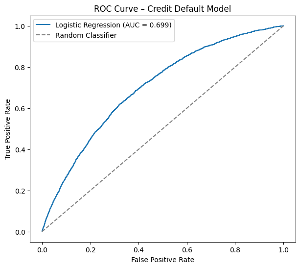
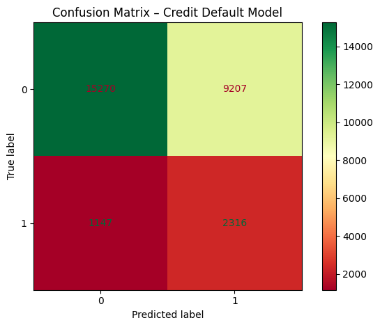
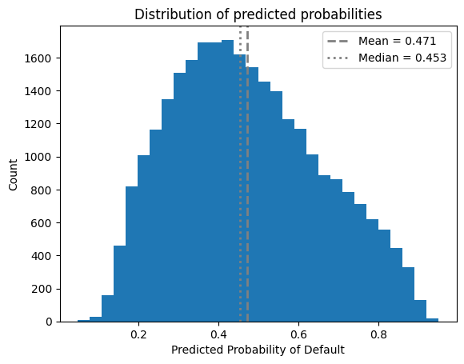
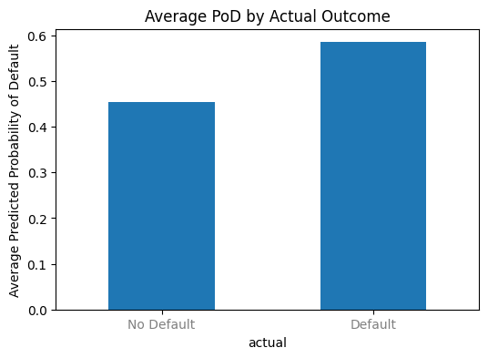
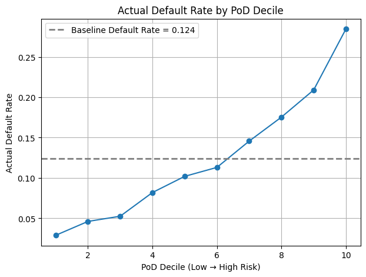
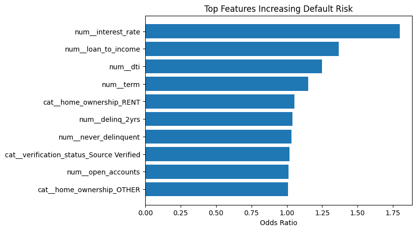
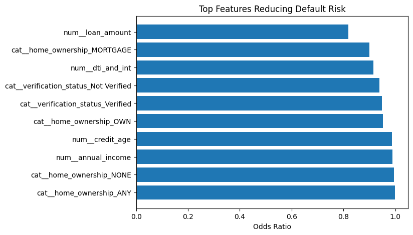

# Credit Default Risk Model – Logistic Regression

This project builds an interpretable **credit default risk model** using logistic regression to estimate the **Probability of Default (PoD)** for individual borrowers. The goal is to mirror how credit risk is evaluated in real lending environments, prioritizing transparency, economic intuition, and practical decision-making.

The model predicts default risk using borrower, loan, and credit characteristics, producing both a continuous PoD score and a binary default classification based on adjustable thresholds. This allows the model to be used for underwriting decisions, risk ranking, and portfolio monitoring.

Rather than focusing solely on accuracy, the model emphasizes **recall for defaults**, reflecting the higher cost of failing to identify risky borrowers. Performance is evaluated using standard credit risk diagnostics such as ROC curves, AUC, confusion matrices, and precision–recall metrics.

Overall, this project demonstrates a realistic and regulator-friendly approach to credit risk modeling, showing how statistical methods can be applied in a transparent and defensible way for financial decision-making.

## Limitations

This model is trained on historical loan performance data and therefore inherits several limitations common to credit risk modeling. The dataset is imbalanced, with significantly fewer default events than non-defaults, which creates tradeoffs between recall and precision depending on the chosen classification threshold. Model performance may vary when applied to borrowers, economic conditions, or lending policies that differ from those observed in the training data. In addition, some borrower attributes may be missing or imperfectly reported, which can introduce noise and reduce predictive stability. As with any statistical model, results should be interpreted as risk estimates rather than deterministic outcomes.

## Business Use Cases

This credit default risk model can support multiple decision-making processes within lending and risk management contexts:

- **Credit underwriting:** Assist loan approval decisions by flagging high-risk applicants before origination.
- **Portfolio risk monitoring:** Track aggregate default risk across existing loan portfolios and identify segments with deteriorating credit quality.
- **Risk-based pricing:** Inform interest rate or fee adjustments based on predicted probability of default.
- **Early warning systems:** Detect emerging risk trends and enable proactive intervention strategies before defaults occur.

## Importing Libraries

This section loads all libraries required for data manipulation, visualization, statistical modeling, and machine learning. The stack combines pandas and NumPy for data handling, matplotlib for visualization, and scikit-learn for preprocessing, model building, and evaluation.

```python
import pandas as pd
import numpy as np
import matplotlib.pyplot as plt

from joblib import dump, load
from sklearn.model_selection import train_test_split
from sklearn.compose import ColumnTransformer
from sklearn.pipeline import Pipeline
from sklearn.impute import SimpleImputer
from sklearn.preprocessing import OneHotEncoder, StandardScaler
from sklearn.linear_model import LogisticRegression
from sklearn.metrics import (
    roc_auc_score,
    roc_curve,
    classification_report,
    confusion_matrix,
    RocCurveDisplay,
    PrecisionRecallDisplay,
    ConfusionMatrixDisplay
)
```
## Loading the Dataset
The loan dataset is loaded from a local CSV file into a pandas DataFrame, which serves as the foundation for all subsequent cleaning, feature engineering, and modeling steps.
```python
df = pd.read_csv("loan.csv")
```

## Data Cleaning and Feature Engineering

This section prepares the raw loan dataset for modeling by filtering valid outcomes, creating the target variable, standardizing column names, and engineering economically meaningful features.

---
### Target Variable Creation

Only loans with final outcomes are kept. A binary default indicator is created where defaulted loans include both charged-off and default statuses.

```python
# Define final loan statuses to keep
final_status = ["Fully Paid", "Charged Off", "Default"]

# Filter dataset to loans with final outcomes only
df = df[df["loan_status"].isin(final_status)].copy()

# Create binary target variable
# 1 = Charged Off or Default
# 0 = Fully Paid
df["default"] = df["loan_status"].isin(["Charged Off", "Default"]).astype(int)
```

### Column Renaming

Column names are standardized for readability and consistency across the project.
```python
renaming_map = {
    "loan_amnt": "loan_amount",
    "int_rate": "interest_rate",
    "emp_length": "employment_length",
    "annual_inc": "annual_income",
    "open_acc": "open_accounts",
    "issue_d": "issue_date",
    "inq_last_6mths": "delinq_last_6mths"
}

df = df.rename(columns=renaming_map)
```

### Date Conversions
Loan issue dates and earliest credit lines are converted into datetime format to allow time-based feature engineering.

```python
df["issue_date"] = pd.to_datetime(df["issue_date"], format="%b-%y")
df["earliest_cr_line"] = pd.to_datetime(df["earliest_cr_line"], format="%b-%y")

df[["issue_date", "earliest_cr_line"]].dtypes.head()
```
### Credit Age Feature
Credit age is calculated as the number of years between the borrower’s first credit line and the loan issue date.
```python
df["credit_age"] = (df["issue_date"] - df["earliest_cr_line"]).dt.days / 365

df["credit_age"].head()
```
### Interaction Variables
Interaction terms capture compounded risk effects that are not visible in individual variables alone.

```python
df["loan_to_income"] = df["loan_amount"] / df["annual_income"]

df["utilization_interaction"] = df["revol_bal"] * df["revol_util"]

df["dti_and_int"] = df["dti"] * df["interest_rate"]
```
### Loan Term Transformation
Loan term is converted from a string format into a numeric variable for modeling.
```python 
df["term"] = df["term"].str.replace("months", "", regex=False)
df["term"] = pd.to_numeric(df["term"], errors="coerce")

df["term"].head()
```
### Delinquency Indicator
A binary variable flags borrowers who have never experienced delinquency.
```python
df["never_delinquent"] = df["mths_since_last_delinq"].isna().astype(int)

df["never_delinquent"].head()
```

### Employment Length Transformation
Employment length is cleaned and converted into numeric years to allow continuous modeling.
```python
df["employment_length"] = df["employment_length"].str.replace("10+ years", "10", regex=False)
df["employment_length"] = df["employment_length"].str.replace("< 1 year", "0.5", regex=False)
df["employment_length"] = df["employment_length"].str.replace(" years", "", regex=False)
df["employment_length"] = df["employment_length"].str.replace(" year", "", regex=False)
df["employment_length"] = df["employment_length"].str.strip()

df["employment_length"] = pd.to_numeric(df["employment_length"], errors="coerce")

df["employment_length"].head()
```

## Feature Selection

This section defines the set of input variables used to train the credit default model. The selected features combine core loan characteristics, borrower financial information, credit history metrics, and engineered interaction terms. Together, they capture both borrower capacity to repay and risk amplification effects that are economically meaningful for default prediction.

```python
features = [
    "loan_amount",
    "term",
    "interest_rate",
    "employment_length",
    "home_ownership",
    "annual_income",
    "verification_status",
    "dti",
    "delinq_2yrs",
    "never_delinquent",
    "credit_age",
    "open_accounts",
    "loan_to_income",
    "utilization_interaction",
    "dti_and_int"
]
```
## Pipeline Creation

This section builds the preprocessing architecture used before model estimation. Features are separated into numerical and categorical groups so that each type can be treated appropriately. This ensures clean inputs, stable model estimation, and proper handling of missing data and categorical levels.

---

### Identifying Feature Types

Categorical variables are explicitly defined, while numerical variables are inferred as the remaining selected features. This separation allows different preprocessing logic to be applied to each group.

```python
categorical_columns = [
    "home_ownership",
    "verification_status",
]

numerical_columns = [
    numcol for numcol in features
    if numcol not in categorical_columns
]
```
### Numerical Preprocessing Pipeline
Numerical features are processed by imputing missing values with the median and scaling them to ensure comparable magnitudes across variables. Scaling is critical for logistic regression stability and interpretability.

```python
numerical_pipeline = Pipeline([
    ("imputer", SimpleImputer(strategy="median")),
    ("scaler", StandardScaler())
])
```
### Categorical Preprocessing Pipeline
Categorical features are processed by imputing missing values with the most frequent category and then applying one-hot encoding. This converts categorical information into a numerical format suitable for the model while safely handling unseen categories.
```python
categorical_pipeline = Pipeline([
    ("imputer", SimpleImputer(strategy="most_frequent")),
    ("onehot", OneHotEncoder(handle_unknown="ignore"))
])
```
## Column Transformer

This section combines the numerical and categorical preprocessing pipelines into a single transformation step. The column transformer ensures that each feature type is processed using the correct logic while keeping the workflow clean, modular, and reproducible.

---

### Combining Preprocessing Pipelines

Numerical features are passed through the numerical pipeline, and categorical features are passed through the categorical pipeline. The result is a unified preprocessing stage that can be seamlessly integrated into the modeling pipeline.

```python
preprocess = ColumnTransformer([
    ("num", numerical_pipeline, numerical_columns),
    ("cat", categorical_pipeline, categorical_columns)
])


## Time-Based Train and Test Split

This section creates a realistic train and test split based on time rather than random sampling. The model is trained on older loans and evaluated on the most recent year of data, which better reflects how credit risk models are deployed in practice.

---

### Defining the Cutoff Date

The cutoff date is set to one year before the most recent loan issue date in the dataset. This ensures the test set represents the latest lending activity.

```python
cutoff_date = df.issue_date.max() - pd.DateOffset(years=1)
```
### Creating Training and Testing Sets
Loans issued before the cutoff date form the training set, while loans issued during the most recent year form the test set.
```python
early_data = df[df.issue_date < cutoff_date]
late_data = df[df.issue_date >= cutoff_date]
```
### Building Feature Matrices and Target Vectors
The feature matrix and target variable are constructed separately for the training and testing datasets.
```python
X_train = early_data[features]
y_train = early_data["default"]

X_test = late_data[features]
y_test = late_data["default"]
```
## Model Definition and Training

This section defines the full modeling pipeline by combining preprocessing and logistic regression into a single, unified workflow. Using a pipeline guarantees that the exact same data transformations applied during training are also applied during testing and future predictions, eliminating data leakage and inconsistencies.

---

### Full Modeling Pipeline

The pipeline first applies the column transformer to handle scaling, imputation, and encoding. It then fits a logistic regression classifier. Class weights are balanced to account for the natural imbalance between default and non-default loans, and the maximum number of iterations is increased to ensure convergence.

```python
model = Pipeline([
    ("preprocess", preprocess),
    ("classifier", LogisticRegression(
        max_iter=2000,
        class_weight="balanced"
    ))
])
```
### Model Training
The full pipeline is trained on the historical loan data. At this stage, both preprocessing parameters and model coefficients are learned exclusively from the training set.
```python
model.fit(X_train, y_train)
```
## Test Set Predictions

This section generates model outputs on the test dataset. Two types of predictions are produced: hard class labels for classification-based evaluation and predicted probabilities for risk ranking and threshold analysis.

---

### Generating Predictions

The model outputs binary predictions indicating default or non-default status, as well as continuous probability estimates representing the predicted probability of default for each loan.

```python
predictions = model.predict(X_test)
predictions_probabilities = model.predict_proba(X_test)[:, 1]
```
## Performance Metrics and Model Diagnostics

This section evaluates model performance on the test set using both classification metrics and probability-based diagnostics. It produces interpretation-friendly tables and graphs to assess discrimination (ranking ability), classification performance, calibration sanity checks, and feature impact through odds ratios.

---

### Classification Metrics and ROC Statistics

This block prints the classification report using hard class predictions and calculates ROC AUC using predicted probabilities. It also computes ROC curve components that will be used for plotting.

```python
print(classification_report(y_test, predictions))

roc_auc = roc_auc_score(y_test, predictions_probabilities)
print("ROC AUC:", roc_auc)

fpr, tpr, thresholds = roc_curve(y_test, predictions_probabilities)
```
### Average Predicted Probability of Default by Actual Outcome
This is a simple calibration sanity check. If the model is behaving logically, loans that actually defaulted should have a higher average predicted probability of default than loans that did not default.
```python
PoD_df = pd.DataFrame({
    "actual": y_test,
    "PoD": predictions_probabilities
})

avg_PoD = PoD_df.groupby("actual")["PoD"].mean()
print(avg_PoD)
```
### Coefficients and Odds Ratios Table
This extracts the trained logistic regression coefficients after preprocessing. Coefficients are converted to odds ratios to make effect sizes easier to interpret. Values above 1 increase default odds, while values below 1 decrease default odds.
```python
logreg = model.named_steps["classifier"]
feature_names = model.named_steps["preprocess"].get_feature_names_out()

coef_table = pd.DataFrame({
    "feature": feature_names,
    "coefficient": logreg.coef_[0]
})

coef_table["odds_ratio"] = np.exp(coef_table["coefficient"])
coef_table = coef_table.sort_values("odds_ratio", ascending=False)

print(coef_table.head(20))
```
### PoD Deciles and Realized Default Rates
This bins predicted probabilities into ten equal-sized groups (deciles). It then computes the realized default rate within each decile to confirm the model ranks risk correctly.
```python
PoD_df["PoD_decile"] = pd.qcut(PoD_df["PoD"], 10, labels=False)

decile_default_rate = (
    PoD_df
    .groupby("PoD_decile")["actual"]
    .mean()
)
```
### Selecting Features for Importance Plots
This identifies the strongest positive and strongest negative coefficients to plot later. Positive coefficients increase predicted default risk, and negative coefficients reduce it.
```python
top_coefficients = coef_table.sort_values("coefficient", ascending=False).head(10)
bottom_coefficients = coef_table.sort_values("coefficient").head(10)
```
## Graphs
These plots visualize discrimination, classification behavior, probability separation, calibration sanity checks, and risk ranking performance.

---
### ROC Curve
This plot shows the tradeoff between true positive rate and false positive rate across thresholds. A higher curve and larger AUC indicate better ranking power.
```python
plt.figure(figsize=(7, 6))
plt.plot(fpr, tpr, label=f"Logistic Regression (AUC = {roc_auc:.3f})")
plt.plot([0, 1], [0, 1], linestyle="--", color="gray", label="Random Classifier")
plt.xlabel("False Positive Rate")
plt.ylabel("True Positive Rate")
plt.title("ROC Curve – Credit Default Model")
plt.legend()
plt.show()
```
---


The ROC curve illustrates the model’s ability to distinguish between defaulting and non-defaulting borrowers across all possible probability thresholds. The curve consistently lies above the random classifier benchmark, with an Area Under the Curve (AUC) of approximately 0.70. This indicates that the model has meaningful discriminatory power and ranks borrowers by risk substantially better than chance. In practical terms, the model is effective at separating higher-risk borrowers from lower-risk ones, even when the exact cutoff for classification is adjusted.

### Confusion Matrix
This plot shows the counts of true negatives, false positives, false negatives, and true positives using the model’s current hard predictions.
```python
plt.clf()
ConfusionMatrixDisplay.from_predictions(
    y_test,
    predictions,
    cmap="RdYlGn",
    values_format="d"
)
plt.title("Confusion Matrix – Credit Default Model")
plt.tight_layout()
plt.show()
```
---


The confusion matrix summarizes classification outcomes at the selected probability threshold. The model correctly identifies a large portion of non-defaulting borrowers while also capturing a meaningful share of true defaults (About 70%). The model is programmed to prioritize accuracy in defaulters’ predictions. This causes some non-default borrowers to be  flagged as high risk. In credit applications, the cost of missing a true default typically exceeds the cost of incorrectly flagging a low-risk borrower, making this balance appropriate for risk management purposes.

### Distribution of Predicted Probabilities
This histogram shows how predicted probabilities are distributed across the test set. It helps you see whether the model is producing meaningful separation or clustering around a narrow range.
```python
mean_pp = predictions_probabilities.mean()
median_pp = np.median(predictions_probabilities)

plt.clf()
plt.hist(predictions_probabilities, bins=30)
plt.axvline(mean_pp, linestyle="--", linewidth=2, label=f"Mean = {mean_pp:.3f}", color="grey")
plt.axvline(median_pp, linestyle=":", linewidth=2, label=f"Median = {median_pp:.3f}", color="grey")
plt.title("Distribution of predicted probabilities")
plt.xlabel("Predicted Probability of Default")
plt.ylabel("Count")
plt.legend()
plt.show()
```
---


This histogram shows the distribution of predicted probabilities of default across all borrowers. The distribution is centered around the mid-range, with a mean near 0.47 and a median near 0.45. This indicates that the model does not produce extreme or unstable predictions but instead assigns nuanced risk scores across the population. Such behavior is desirable in credit models, as it supports ranking, segmentation, and threshold tuning rather than rigid binary decisions.

### Average PoD by Actual Outcome
This bar chart compares the average predicted probability of default across actual outcomes. Defaults should have the higher average.
```python
plt.clf()
avg_PoD.plot(kind="bar", figsize=(6, 4))
plt.xticks([0, 1], ["No Default", "Default"], rotation=0, color="grey")
plt.ylabel("Average Predicted Probability of Default")
plt.title("Average PoD by Actual Outcome")
plt.show()
```
---


This chart compares average predicted probabilities for borrowers who ultimately defaulted versus those who did not. Borrowers who defaulted received meaningfully higher predicted probabilities than those who remained current. This separation confirms that the model’s probability estimates are directionally correct and economically intuitive, reinforcing confidence in the model’s ability to rank-order risk even when exact classification is imperfect.

### Actual Default Rate by PoD Decile
This plot tests risk ranking. Realized default rates should rise as deciles move from low predicted risk to high predicted risk. The dashed line shows the baseline default rate in the test set.
```python 
baseline_default_rate = y_test.mean()

plt.clf()
plt.figure(figsize=(7, 5))
plt.plot(decile_default_rate.index + 1, decile_default_rate.values, marker="o")
plt.xlabel("PoD Decile (Low → High Risk)")
plt.ylabel("Actual Default Rate")
plt.title("Actual Default Rate by PoD Decile")
plt.axhline(
    baseline_default_rate,
    linestyle="--",
    linewidth=2,
    label=f"Baseline Default Rate = {baseline_default_rate:.3f}",
    color="grey"
)
plt.grid(True)
plt.legend()
plt.show()
```
---


This decile plot provides one of the strongest validations of model performance. As predicted risk increases from the lowest to highest decile, the observed default rate rises steadily and materially. The highest-risk decile exhibits more than double the baseline default rate. This monotonic relationship demonstrates strong risk stratification and confirms that the model effectively concentrates default risk in higher predicted probability buckets, which is critical for portfolio 

### Feature Importance via Odds Ratios
These plots visualize the features with the largest odds ratios and smallest odds ratios. This provides an interpretable view of which variables increase or reduce default odds the most.
```python
plt.clf()
plt.figure(figsize=(7, 5))
plt.barh(top_coefficients["feature"], top_coefficients["odds_ratio"])
plt.xlabel("Odds Ratio")
plt.title("Top Features Increasing Default Risk")
plt.gca().invert_yaxis()
plt.show()

plt.clf()
plt.figure(figsize=(7, 5))
plt.barh(bottom_coefficients["feature"], bottom_coefficients["odds_ratio"])
plt.xlabel("Odds Ratio")
plt.title("Top Features Reducing Default Risk")
plt.gca().invert_yaxis()
plt.show()
```
---




These two charts together illustrate the variables that most strongly influence default risk, both upward and downward. Factors such as higher interest rates, elevated loan-to-income and debt-to-income ratios, and prior delinquencies significantly increase the probability of default, reflecting financial strain and weaker repayment capacity. At the same time, characteristics like higher income, longer credit history, home ownership, and larger loan amounts are associated with lower default risk, signaling borrower stability and stronger creditworthiness. Viewed jointly, these patterns confirm that the model captures the expected economic relationships between borrower characteristics and credit outcomes, providing both predictive power and interpretability that align with established credit risk principles.

